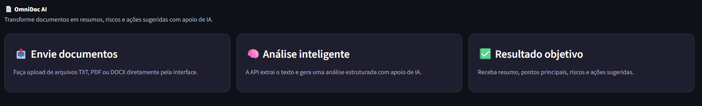
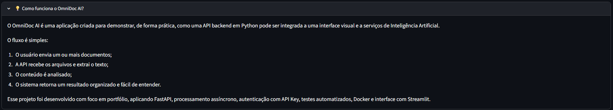
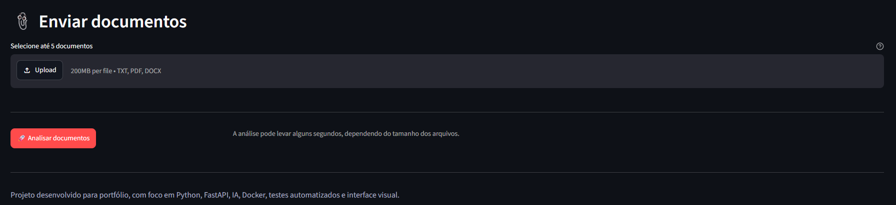
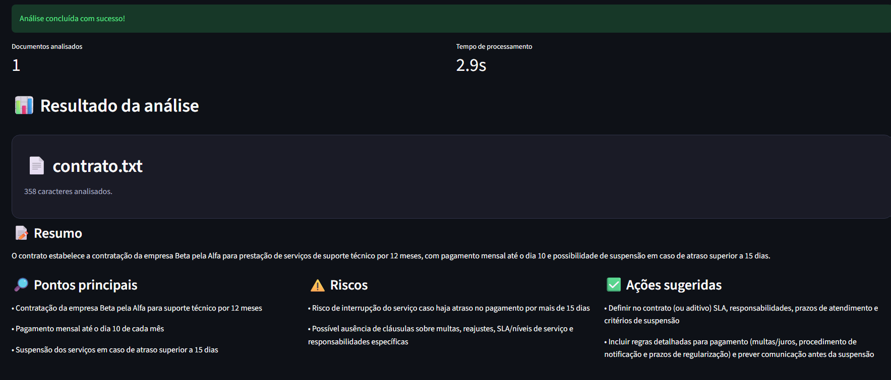

# 📄 OmniDoc AI

API assíncrona desenvolvida com **Python** e **FastAPI** para análise automatizada de documentos com apoio de Inteligência Artificial.

O projeto permite o envio de documentos em formato **TXT, PDF ou DOCX** e retorna uma análise estruturada com resumo, pontos principais, possíveis riscos e ações sugeridas.

---

## 🚀 Sobre o projeto

O **OmniDoc AI** foi criado com o objetivo de praticar o desenvolvimento de uma solução backend moderna em Python, aplicando conceitos de:

- APIs REST;
- Processamento assíncrono;
- Upload e leitura de arquivos;
- Integração com API de Inteligência Artificial;
- Autenticação simples com API Key;
- Testes automatizados;
- Docker;
- Interface visual com Streamlit.

A ideia do projeto é simular uma ferramenta capaz de auxiliar na leitura e análise de documentos extensos, transformando informações complexas em respostas mais objetivas e organizadas.

---

## 🧠 Funcionalidades

- Upload de documentos em TXT, PDF e DOCX;
- Análise de documento único;
- Análise de múltiplos documentos;
- Extração automática de texto;
- Geração de resumo;
- Identificação de pontos principais;
- Identificação de possíveis riscos;
- Sugestão de ações;
- Autenticação por API Key;
- Interface visual para upload de arquivos;
- Testes automatizados com Pytest;
- Containerização com Docker;
- Documentação automática com Swagger.

---

## 🛠️ Tecnologias utilizadas

- Python
- FastAPI
- Asyncio
- OpenAI API
- Pydantic
- PyPDF
- Python-docx
- Streamlit
- Pytest
- Docker
- Uvicorn
- Git e GitHub

---

## 📁 Estrutura do projeto

```txt
omnidoc-ai/
├── app/
│   ├── __init__.py
│   ├── main.py
│   ├── schemas.py
│   ├── security.py
│   └── services/
│       ├── __init__.py
│       ├── ai_analyzer.py
│       └── document_reader.py
├── frontend/
│   └── streamlit_app.py
├── tests/
│   └── test_main.py
├── samples/
│   ├── contrato.txt
│   ├── contrato_2.txt
│   └── contrato_3.txt
├── docs/
│   └── images/
├── Dockerfile
├── .dockerignore
├── .env.example
├── .gitignore
├── pytest.ini
├── requirements.txt
└── README.md
```

---

## ⚙️ Como rodar o projeto localmente

### 1. Clone o repositório

```bash
git clone https://github.com/RayaraVilar/proj_python_01_omnidocAI.git
```

### 2. Entre na pasta do projeto

```bash
cd proj_python_01_omnidocAI
```

### 3. Crie o ambiente virtual

```bash
python -m venv .venv
```

### 4. Ative o ambiente virtual no Windows

```bash
.venv\Scripts\activate
```

### 5. Instale as dependências

```bash
pip install -r requirements.txt
```

---

## 🔐 Variáveis de ambiente

Crie um arquivo chamado **`.env`** na raiz do projeto, usando o arquivo **`.env.example`** como base.

Exemplo:

```env
OPENAI_MODEL=seu_modelo_disponivel
MOCK_AI=true
OPENAI_API_KEY=sua_chave_openai
API_ACCESS_KEY=dev-secret-key
API_URL=http://127.0.0.1:8000
```

### Observação

Para testar o projeto sem consumir créditos de IA, mantenha:

```env
MOCK_AI=true
```

Para usar a análise real com IA, configure sua chave da OpenAI e altere para:

```env
MOCK_AI=false
```

---

## ▶️ Rodando a API

Com o ambiente virtual ativo, rode:

```bash
uvicorn app.main:app --reload
```

Acesse no navegador:

```txt
http://127.0.0.1:8000
```

Documentação Swagger:

```txt
http://127.0.0.1:8000/docs
```

---

## 🖥️ Rodando a interface visual

Em outro terminal, com o ambiente virtual ativo, rode:

```bash
streamlit run frontend/streamlit_app.py
```

Acesse no navegador:

```txt
http://localhost:8501
```

Na interface, informe a API Key configurada no `.env`, envie os documentos e clique em **Analisar documentos**.

---

## 🔑 Autenticação

Os endpoints de análise exigem envio de API Key no header da requisição.

Header necessário:

```txt
X-API-Key: sua_api_key
```

Exemplo:

```txt
X-API-Key: dev-secret-key
```

---

## 📌 Endpoints da API

### GET /

Endpoint inicial da API.

### GET /health

Verifica se a API está funcionando.

### POST /analyze

Recebe um documento TXT, PDF ou DOCX e retorna uma análise automatizada.

### POST /analyze-batch

Recebe até 5 documentos TXT, PDF ou DOCX e processa todos de forma assíncrona.

---

## 📊 Exemplo de resposta

```json
{
  "total_documents": 1,
  "processing_time_seconds": 0.03,
  "documents": [
    {
      "filename": "contrato.txt",
      "characters": 350,
      "summary": "Resumo automatizado do documento enviado.",
      "key_points": [
        "Documento recebido e processado com sucesso.",
        "Texto extraído automaticamente.",
        "Análise simulada para ambiente de desenvolvimento."
      ],
      "risks": ["A análise real com IA ainda está desativada."],
      "suggested_actions": [
        "Configurar a variável OPENAI_API_KEY.",
        "Definir MOCK_AI=false para usar IA real.",
        "Testar com documentos TXT, PDF e DOCX."
      ]
    }
  ]
}
```

---

## 🧪 Testes automatizados

O projeto possui testes automatizados com **Pytest** para validar os principais comportamentos da API.

Para rodar os testes:

```bash
pytest
```

Os testes cobrem:

- Endpoint inicial `/`;
- Endpoint de saúde `/health`;
- Bloqueio de requisições sem API Key;
- Análise de documento único;
- Análise de múltiplos documentos;
- Validação de formato de arquivo não suportado.

---

## 🐳 Docker

O projeto pode ser executado em container Docker.

### Gerar a imagem

```bash
docker build -t omnidoc-ai .
```

### Rodar o container

```bash
docker run --name omnidoc-ai-container -p 8000:8000 --env-file .env omnidoc-ai
```

Depois acesse:

```txt
http://127.0.0.1:8000/docs
```

Caso o container já exista, remova com:

```bash
docker rm -f omnidoc-ai-container
```

---

## 🖼️ Demonstração

### Documentação da API


### Exemplo de resposta







---

## 💡 O que aprendi

Durante o desenvolvimento deste projeto, pratiquei:

- Criação de APIs REST com FastAPI;
- Organização de código em camadas;
- Uso de ambiente virtual em Python;
- Upload e leitura de arquivos;
- Processamento assíncrono com Asyncio;
- Integração com API de Inteligência Artificial;
- Uso de variáveis de ambiente;
- Autenticação simples com API Key;
- Escrita de testes automatizados;
- Uso de Docker para padronização do ambiente;
- Criação de interface visual com Streamlit;
- Versionamento com Git e publicação no GitHub.

---

## 🗺️ Roadmap

- [x] Criar API com FastAPI
- [x] Implementar upload de documentos
- [x] Extrair texto de arquivos TXT, PDF e DOCX
- [x] Preparar integração com IA
- [x] Adicionar processamento de múltiplos documentos
- [x] Criar autenticação simples
- [x] Adicionar testes automatizados
- [x] Containerizar com Docker
- [x] Criar interface visual para upload dos documentos
- [ ] Melhorar layout da interface
- [ ] Adicionar histórico de análises
- [ ] Criar exportação do resultado em PDF
- [ ] Adicionar autenticação com usuário e senha

---

## 📌 Status do projeto

Projeto em desenvolvimento para fins de portfólio, com foco em demonstrar conhecimentos práticos em **Python**, **FastAPI**, **IA**, **Docker**, **testes automatizados** e **interface visual**.

---

## 👩‍💻 Desenvolvido por

**Rayara Vilar**

- GitHub: [RayaraVilar](https://github.com/RayaraVilar)
- LinkedIn: [rayara-vilar](https://www.linkedin.com/in/rayara-vilar)
