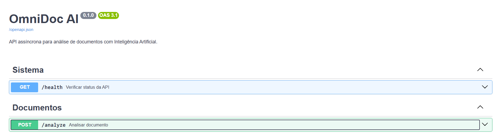
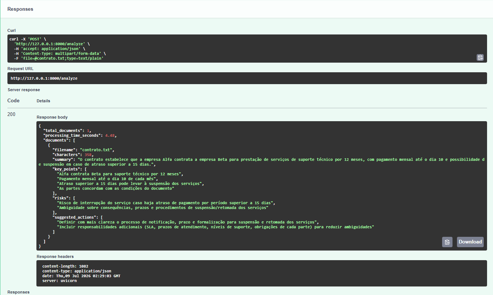

# OmniDoc AI

API assíncrona desenvolvida com Python e FastAPI para análise automatizada de documentos com Inteligência Artificial.

## Sobre o projeto

O OmniDoc AI permite o envio de documentos em formato TXT, PDF ou DOCX e retorna uma análise estruturada contendo:

- Resumo do documento;
- Pontos principais;
- Possíveis riscos;
- Ações sugeridas.

O projeto foi desenvolvido com foco em backend, processamento assíncrono, integração com API de IA e boas práticas de organização de código.

## Tecnologias utilizadas

- Python
- FastAPI
- Asyncio
- OpenAI API
- Pydantic
- PyPDF
- Python-docx
- Uvicorn
- Git e GitHub

## O que aprendi

Durante o desenvolvimento deste projeto, pratiquei:

- Criação de APIs REST com FastAPI;
- Uso de ambiente virtual em Python;
- Organização de código em camadas;
- Upload e leitura de arquivos TXT, PDF e DOCX;
- Uso de variáveis de ambiente com `.env`;
- Integração com API de Inteligência Artificial;
- Versionamento com Git e publicação no GitHub.

## Demonstração

### Documentação da API



### Exemplo de resposta



## Como rodar o projeto

Clone o repositório:

```bash
git clone https://github.com/RayaraVilar/proj_python_01_omnidocAI.git
```
